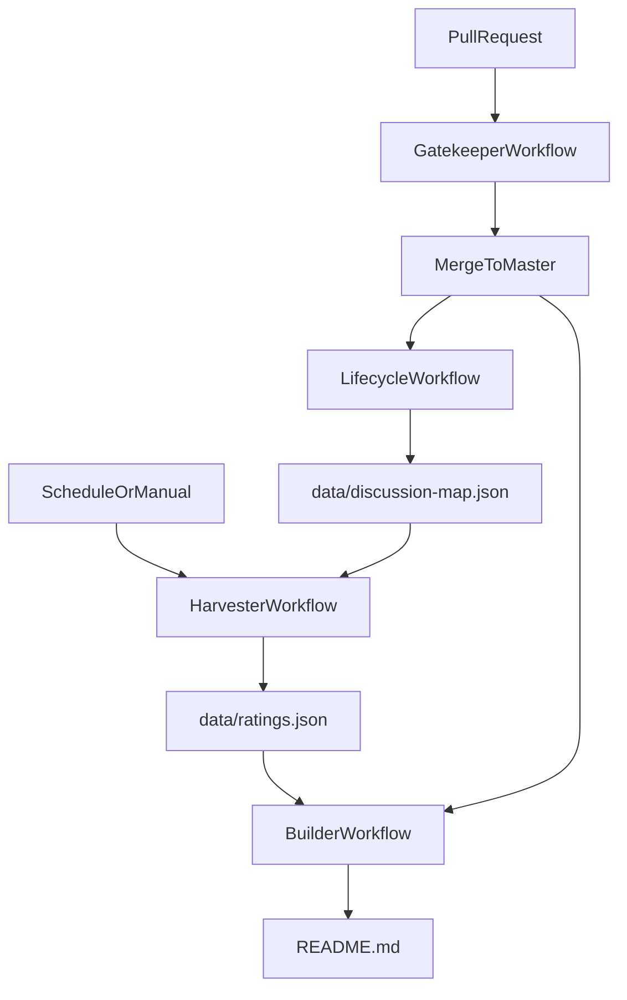

# Architecture: GitOps + GitHub Discussions Ratings

This repository uses a **GitOps model**:

- **GitHub = database**: the canonical dataset is committed to the repository.
- **GitHub Discussions = voting/ratings system**: each resource has a dedicated Discussion used for votes/reactions.
- **GitHub Actions = automation**: bots validate changes, create/close Discussions, harvest ratings, and regenerate `README.md`.

## Files and ownership

### Human-edited (PRs welcome)

- `data/resources.json`: resource catalog (stable `id` per resource).
- `data/collections.json`: curated collections referencing `resource_ids`.
- `scripts/generate-readme.ts`: README generator.
- `types/index.ts`: data types used by tooling/app.

### Bot-managed (do not edit manually)

- `data/discussion-map.json`: mapping of `{ "resource_id": "discussion_node_id" }`.
- `data/ratings.json`: computed ratings harvested from Discussions.
- `README.md`: the section between markers is regenerated by the builder workflow.

PRs that modify bot-managed files are rejected by the Gatekeeper workflow.

## Workflow interactions (end-to-end)

## Workflows

### A. Gatekeeper (`.github/workflows/gatekeeper.yml`)

Runs on PRs targeting `master`.

- Validates JSON syntax for `data/resources.json` and `data/collections.json`.
- Enforces uniqueness of `resources[].id`.
- Ensures all `collections[].resource_ids[]` exist in `data/resources.json`.
- Ensures all `resources[].related_ids[]` resolve.
- **Security policy**: fails if the PR modifies `data/ratings.json` or `data/discussion-map.json`.

Implementation lives in `scripts/gitops/validate-pr.ts`.

### B. Lifecycle Manager (`.github/workflows/lifecycle.yml`)

Runs on pushes to `master` when `data/resources.json` changes.

- Diffs the previous and current `resources.json`.
- For each **added resource id**: creates a new Discussion in the `Resource Ratings` category and stores the mapping in `data/discussion-map.json`.
- For each **removed resource id**: closes and locks the mapped Discussion, then removes it from the mapping file.
- Commits and pushes `data/discussion-map.json` back to `master`.

Implementation lives in `scripts/gitops/lifecycle.ts`.

### C. Harvester (`.github/workflows/harvester.yml`)

Runs on a schedule (every 12 hours) and via manual trigger.

- Reads `data/discussion-map.json`.
- Fetches each Discussion’s `upvoteCount` and reaction totals via the GitHub GraphQL API.
- Computes a per-resource rating and writes `data/ratings.json`.
- Commits and pushes `data/ratings.json` back to the repo.

Implementation lives in `scripts/gitops/harvest.ts`.

### D. Builder (`.github/workflows/builder.yml`)

Runs on pushes to `master` when `data/resources.json`, `data/collections.json`, or `data/ratings.json` changes.

- Runs `npm run readme`.
- If `README.md` changed, commits and pushes the updated file.

The existing `.github/workflows/readme.yml` remains a **PR-only verifier** (it regenerates and checks diffs but does not commit).

## Discussion category resolution

The Lifecycle script resolves the Discussion category by:

1. slug `resource-ratings`
2. fallback name `Resource Ratings`

This makes the automation resilient to display-name changes as long as the slug stays stable.

## Rating math

Current scoring (confirmed):

\[
score = (upvoteCount \\times 1)
      + (THUMBS\\_UP \\times 1)
      + (HEART \\times 3)
      + (HOORAY \\times 5)
      + (THUMBS\\_DOWN \\times -2)
      + (CONFUSED \\times -1)
\]

- `upvoteCount` comes from the Discussion `upvoteCount` field.\n+- Reaction totals come from `reactionGroups` (per reaction type).

If a resource has no rating entry in `data/ratings.json`, the README generator will omit the suffix.

## Operational notes

- The workflows use the built-in `GITHUB_TOKEN`.\n- Required permissions are declared in each workflow (`contents: write`, `discussions: write/read`).\n- If Discussion creation fails for some resources, re-running the Lifecycle workflow on the same commit is safe: existing mappings are preserved.\n- If harvesting fails due to transient API errors or rate limits, the Harvester workflow can be re-run manually.

